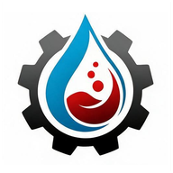

# FTM — Fuel Tank Management

<div align="center">



**Platform IoT untuk pemantauan bahan bakar, pengelolaan perangkat, dan visibilitas operasional tangki.**

[](docs/current-operational-truth.md)
[](https://github.com/Zendin110206/solar-tank-monitoring-system/actions/workflows/ci.yml)
[](https://nextjs.org/)
[](https://www.typescriptlang.org/)
[](LICENSE)

[Aplikasi aktif](https://solar-tank-monitoring-system.vercel.app) · [Status operasional](docs/current-operational-truth.md) · [Arsitektur](docs/architecture.md) · [Panduan pengguna](docs/panduan-user-manual-ftm.pdf)

</div>

## Gambaran Umum

FTM menghubungkan sensor tangki, perangkat ESP8266, layanan penerimaan data,
MySQL, dan dashboard web dalam satu alur pemantauan. Platform menyediakan
pembacaan terkini, riwayat volume, estimasi waktu operasional, status koneksi
perangkat, pengelolaan akun, penyiapan perangkat, serta dukungan operasional
melalui Telegram dan helpdesk.

Sistem saat ini digunakan sebagai **pilot operasional aktif** dalam konteks
infrastruktur Telkom Indonesia/Telkominfra, dengan cakupan awal TIF
Pasuruan–Sidoarjo. Aplikasi aktif berjalan di Vercel dan menerima telemetri dari
perangkat lapangan yang terdaftar pada Aiven MySQL.

FTM dikelola sebagai sistem yang terus berkembang. Penguatan keamanan perangkat,
pemantauan sistem, pemulihan data, kontrol akses per lokasi, dan validasi
kapasitas menjadi bagian dari peta jalan menuju penggunaan pada cakupan yang
lebih luas.

> Status pilot tidak menyatakan FTM sebagai produk nasional atau sistem
> keselamatan yang telah memperoleh persetujuan produksi korporat. Keputusan
> operasional tetap mengikuti verifikasi lapangan dan prosedur yang berlaku.

## Status Operasional

| Bagian | Status |
|---|---|
| Tahap pengembangan | Pilot operasional aktif; dipelihara dan dikembangkan secara berkelanjutan |
| Cakupan awal | TIF Pasuruan–Sidoarjo |
| Perangkat terdaftar | 3 lokasi, 3 tangki, dan 3 perangkat pada pemeriksaan operasional terakhir |
| Platform aplikasi | Vercel |
| Database operasional | Aiven MySQL |
| Pemantauan langsung | Snapshot terbaru per perangkat dengan pembaruan dashboard setiap 20 detik |
| Riwayat telemetri | Agregat 5 menit berisi rata-rata, minimum, maksimum, dan jumlah sampel |
| Pengaturan akses | Akun terverifikasi dengan peran admin dan pengguna |

Jumlah perangkat dapat berubah mengikuti perkembangan penerapan. Kondisi
terkini, batas klaim, dan catatan operasional dipelihara dalam dokumen
[Status Operasional Saat Ini](docs/current-operational-truth.md).

## Arsitektur Sistem

```text
Sensor ultrasonik
       │
       ▼
Perangkat ESP8266
       │  telemetri terautentikasi
       ▼
POST /api/ingest
       │
       ├── validasi identitas perangkat dan data
       ├── normalisasi konfigurasi
       └── pemeriksaan kesesuaian dengan registri
       │
       ▼
Aiven MySQL
       ├── snapshot terbaru per perangkat ──► dashboard langsung
       └── agregat 5 menit ─────────────────► grafik dan ekspor CSV
       │
       ▼
Aplikasi Next.js di Vercel
       ├── dashboard operator dan admin
       ├── pengelolaan akun dan perangkat
       └── integrasi Telegram dan helpdesk
```

Penjelasan komponen, batas tanggung jawab, dan hubungan antarfitur tersedia dalam
[Arsitektur](docs/architecture.md) dan
[Batas Sistem](docs/system-boundaries.md).

## Siklus Data

FTM memisahkan data untuk tampilan langsung dan analisis historis:

- **Snapshot terbaru** menyimpan satu pembacaan terakhir untuk setiap perangkat.
  Nilainya diperbarui setiap telemetri baru diterima dan menjadi sumber utama
  dashboard langsung.
- **Agregat 5 menit** merangkum sampel menjadi nilai rata-rata, minimum,
  maksimum, dan jumlah sampel. Model ini mempertahankan informasi analitis
  dengan pertumbuhan penyimpanan yang lebih terkendali.
- **Data registri** menyimpan identitas lokasi, tangki, perangkat, parameter
  kapasitas, serta konfigurasi yang telah disetujui.
- **Catatan audit** menyimpan perubahan penting pada akun dan proses administratif.

Kontrak dan struktur data dijelaskan lebih lanjut dalam
[Model Data](docs/data-model.md), [Kontrak API](docs/api-contract.md), dan
[Penerimaan Data Perangkat](docs/device-ingestion.md).

## Kemampuan Utama

### Pemantauan

- ringkasan lokasi melalui tampilan kartu dan peta;
- penyaring Regional, Wilayah, Area, STO, dan status perangkat;
- pembacaan volume, persentase isi, waktu data diterima, dan status koneksi;
- estimasi waktu operasional berdasarkan kapasitas dan konsumsi;
- tren harian, mingguan, dan bulanan;
- ekspor CSV sesuai rentang data yang dipilih;
- deteksi perbedaan konfigurasi perangkat dan registri.

### Siklus perangkat

- pengajuan perangkat dan data lokasi oleh pengguna;
- peninjauan dan persetujuan oleh admin;
- perhitungan parameter kapasitas dan konsumsi;
- pembuatan kunci perangkat, konfigurasi, dan paket firmware per perangkat;
- aktivasi setelah perangkat mengirim data valid pertama;
- pengelolaan data uji dan pengosongan pembacaan secara selektif.

### Identitas dan akses

- pendaftaran, verifikasi email, login, dan pemulihan kata sandi;
- peran admin dan pengguna;
- cookie sesi `httpOnly` dan hash kata sandi Argon2id;
- OTP untuk tindakan administratif tertentu;
- Cloudflare Turnstile untuk formulir publik saat diaktifkan;
- satu identitas Telegram untuk satu akun FTM;
- pencabutan sesi dan audit aktivitas penting.

### Operasional

- helpdesk web dengan notifikasi Telegram;
- perintah Telegram untuk bantuan, status akun, dan akses dashboard;
- pemeriksaan kesehatan dan kesiapan layanan;
- pencadangan MySQL secara manual maupun terjadwal;
- migrasi database yang berurutan dan aman dijalankan ulang;
- pemeriksaan kualitas otomatis melalui GitHub Actions.

## Teknologi

| Lapisan | Teknologi |
|---|---|
| Aplikasi web | Next.js 16 App Router, React 19, TypeScript strict |
| Antarmuka | Tailwind CSS 4, lucide-react, Three.js |
| Data | MySQL, `mysql2`, Aiven |
| Identitas dan komunikasi | Argon2id, email SMTP, Cloudflare Turnstile, Telegram Bot API |
| Perangkat | ESP8266, sensor ultrasonik, paket firmware per perangkat |
| Penerapan aplikasi | Vercel |
| Pengujian kualitas | Vitest, ESLint, TypeScript, build produksi Next.js, GitHub Actions |

## Struktur Repositori

```text
.
├── .github/                 # alur CI dan template laporan
├── config/                  # template registri yang aman dipublikasikan
├── database/
│   ├── migrations/         # migrasi skema MySQL yang berurutan
│   └── seeds/              # data contoh khusus pengembangan
├── docs/                    # arsitektur, operasional, keamanan, dan panduan
├── firmware/templates/      # template firmware perangkat
├── scripts/                 # migrasi, pencadangan, simulator, dan pengujian awal
└── src/
    ├── app/                 # halaman dan Route Handler Next.js
    ├── components/          # komponen antarmuka yang digunakan bersama
    └── features/
        ├── auth/            # akun, sesi, email, Telegram, dan audit
        ├── helpdesk/        # alur dukungan web dan Telegram
        └── monitoring/      # logika domain, penyimpanan, dashboard, dan pengujian
```

## Memulai Pengembangan

### Prasyarat

- Node.js 20 atau lebih baru;
- pnpm 9.15.3;
- MySQL untuk pengembangan dengan penyimpanan permanen.

### Menjalankan server pengembangan

```powershell
git clone https://github.com/Zendin110206/solar-tank-monitoring-system.git
cd solar-tank-monitoring-system
corepack enable
pnpm install
pnpm dev
```

Aplikasi dapat dibuka melalui `http://localhost:3000`.

Mode pengembangan menggunakan penyimpanan memori dan data contoh yang aman
dipublikasikan secara default. Telemetri perangkat dapat disimulasikan tanpa
perangkat fisik:

```powershell
pnpm simulate:device --once
```

### Lingkungan pengembangan MySQL

Buat `.env.local` berdasarkan `.env.example`, masukkan kredensial database
pengembangan yang telah diizinkan, kemudian siapkan skemanya:

```powershell
pnpm db:setup:mysql
pnpm auth:create-admin
pnpm dev
```

Perintah `db:setup:mysql` menyertakan data contoh dan hanya ditujukan untuk
database pengembangan yang masih kosong. Database yang telah berisi data wajib
dicadangkan sebelum migrasi berurutan dijalankan dan tidak boleh menerima data
contoh pengembangan.

```powershell
pnpm db:backup:mysql
pnpm db:migrate:mysql
pnpm db:migrate:auth
pnpm db:migrate:auth-recovery
pnpm db:migrate:device-provisioning
pnpm db:migrate:device-request-fields
pnpm db:migrate:helpdesk
pnpm db:migrate:reading-rollup
pnpm db:migrate:auth-telegram
pnpm db:migrate:site-taxonomy
```

Kebutuhan penerapan, urutan migrasi, dan pemeriksaan kesiapan dijelaskan dalam
[Panduan Penerapan](docs/deployment.md).

## Perintah Utama

| Perintah | Fungsi |
|---|---|
| `pnpm dev` | Menjalankan server pengembangan dengan Turbopack |
| `pnpm dev:lan` | Membuka server pengembangan pada jaringan lokal yang diizinkan |
| `pnpm dev:webpack` | Menggunakan Webpack sebagai pilihan kompatibilitas |
| `pnpm simulate:device` | Mengirim telemetri contoh ke endpoint penerimaan data |
| `pnpm pilot:hash-key` | Membuat kredensial untuk penyiapan perangkat yang diizinkan |
| `pnpm pilot:registry` | Memvalidasi dan menerapkan registri lokal yang tidak dilacak Git |
| `pnpm pilot:smoke` | Menguji penerimaan data dengan format perangkat |
| `pnpm db:backup:mysql` | Membuat cadangan MySQL di direktori yang diabaikan Git |
| `pnpm db:migrate:*` | Menjalankan satu migrasi skema |
| `pnpm check` | Menjalankan pemeriksaan tipe, lint, pengujian, dan build produksi |

## Konfigurasi dan Keamanan

`.env.example` mendokumentasikan nama konfigurasi tanpa menyertakan nilai
operasional. Data produksi dan kredensial tidak disimpan dalam repositori ini.

- rahasia, URL database, kunci perangkat, token, dan data akun harus berada di
  luar kontrol versi;
- hanya nilai yang aman untuk browser yang boleh memakai awalan `NEXT_PUBLIC_`;
- registri operasional dan data lokasi terperinci tidak boleh di-commit;
- `config/pilot-registry.example.json` adalah template publik, sedangkan
  `*.local.json` tidak dilacak Git;
- seed dan data simulator merupakan data pengembangan, bukan data operasional;
- laporan keamanan mengikuti proses privat dalam [SECURITY.md](SECURITY.md).

Batas operasional dan perangkat fisik dipelihara dalam
[Batasan dan Keselamatan](docs/safety-and-limitations.md).

## Pengendalian Kualitas

Setiap perubahan wajib melewati pemeriksaan proyek secara menyeluruh:

```powershell
pnpm check
```

Perintah tersebut menjalankan pemeriksaan tipe TypeScript, ESLint, seluruh
pengujian Vitest, dan build produksi Next.js. Perubahan perilaku aplikasi juga
wajib diuji pada alur yang terdampak. Pemeriksaan perangkat lunak tidak
menggantikan kalibrasi sensor, pemeriksaan instalasi, atau prosedur keselamatan
operasional.

## Peta Jalan Produk

Pengembangan berlanjut melalui beberapa fokus berikut:

- keamanan komunikasi firmware, kontrol OTA, dan pengamanan diagnostik;
- dokumentasi kalibrasi dan toleransi pengukuran setiap tangki;
- notifikasi otomatis untuk level kritis, perangkat terlambat, dan kegagalan
  pengiriman data;
- pembatasan akses berdasarkan lokasi untuk tim operasional yang lebih besar;
- retensi cadangan terenkripsi dan latihan pemulihan berkala;
- pemantauan sistem terpusat, penanganan insiden, dan rotasi kredensial;
- validasi beban, kuota, dan biaya sebelum perluasan penerapan;
- pengelolaan rilis dan kepemilikan operasional untuk pemeliharaan jangka panjang.

Prioritas dan syarat kesiapan dijelaskan dalam
[Peta Jalan](docs/roadmap.md) dan [Kesiapan Pilot](docs/pilot-readiness.md).

## Dokumentasi

| Dokumen | Cakupan |
|---|---|
| [Status Operasional Saat Ini](docs/current-operational-truth.md) | Kondisi penerapan dan batas klaim terkini |
| [Arsitektur](docs/architecture.md) | Komponen, ketergantungan, dan alur data |
| [Kontrak API](docs/api-contract.md) | Kontrak endpoint dan format data |
| [Model Data](docs/data-model.md) | Lokasi, tangki, perangkat, pembacaan, dan penyiapan perangkat |
| [Penerimaan Data Perangkat](docs/device-ingestion.md) | Autentikasi, normalisasi, dan validasi data masuk |
| [Penerapan](docs/deployment.md) | Lingkungan, migrasi, kesiapan, dan alur rilis |
| [Pencadangan Database](docs/database-backup.md) | Pencadangan, retensi, dan batas pemulihan |
| [Batasan dan Keselamatan](docs/safety-and-limitations.md) | Batas perangkat lunak, data, perangkat fisik, dan operasional |
| [Panduan Peninjau](docs/reviewer-quickstart.md) | Alur pemeriksaan teknis |
| [Panduan Pengguna](docs/panduan-user-manual-ftm.pdf) | Panduan bagi pengguna akhir |

## Kontribusi

Ketentuan kontribusi tersedia dalam [CONTRIBUTING.md](CONTRIBUTING.md). Setiap
perubahan harus menjaga keamanan data contoh untuk repositori publik,
mempertahankan batas keamanan yang telah ditetapkan, menyertakan pengujian yang
sesuai, dan lulus seluruh pemeriksaan kualitas proyek.

| Kontributor | Fokus kontribusi |
|---|---|
| [Muhammad Zaenal Abidin Abdurrahman](https://github.com/Zendin110206) | Koordinasi proyek, arsitektur aplikasi, sisi server dan database, identitas, penerapan, integrasi, pengujian, dan peninjauan |
| [Yattaqi Muazirul Mulki](https://github.com/ukiirving) | Desain antarmuka dan pengembangan aplikasi |
| [Astra](https://github.com/Ata22) | Pengembangan perangkat dan firmware, pengujian lapangan, integrasi Telegram, dan masukan operasional |

## Lisensi

Kode sumber tersedia berdasarkan [Lisensi MIT](LICENSE). Nama, logo, kredensial,
data operasional, dan informasi pihak lain tidak termasuk dalam pemberian lisensi
tersebut.
